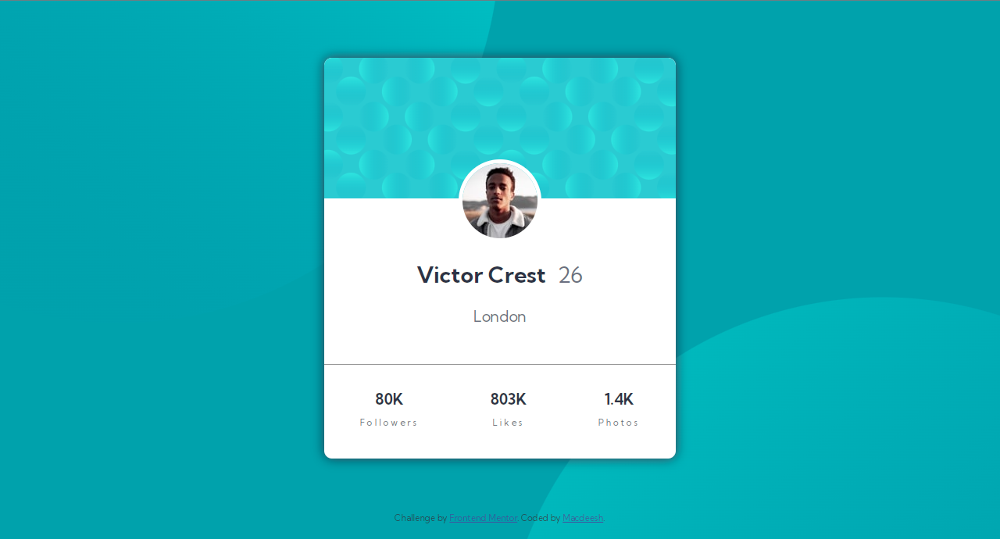

# Profile-card-component
Frontend Mentor Challenge

This is a solution to the [Profile card component Challenge](https://www.frontendmentor.io/challenges/profile-card-component-cfArpWshJ). 

## Links

- Solution URL: [https://github.com/macdeesh/Profile-card-component]
- Live Site URL: [https://macdeesh.github.io/Profile-card-component/]

## Screenshot


   
## What I learned 

- I learned how to use different background images and change the position of each one :

```css
body {
    background: url(../images/bg-pattern-top.svg), url(../images/bg-pattern-bottom.svg), var(--Dark-cyan);
    background-position: right 50vw bottom 40vh, left 50vw top 55vh;
    background-repeat: no-repeat;
 }
````
- I tried to change the position on elements vertivally by using ```position: relative;``` and ```top: 50px;``` or bottom, left and right.
   
## Author

 - Github - [Macdeesh](https://github.com/macdeesh)
 - Twitter - [@Macdiish](https://twitter.com/Macdiish)
